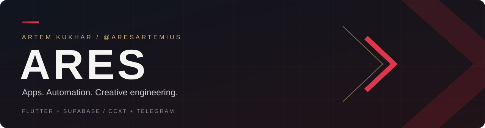

  

# Hey, I'm Artem Kukhar (aka Ares) 👋

**Software developer & [CCXT contributor](https://github.com/ccxt/ccxt).** I build mobile apps, web platforms and trading automation. My projects bring together product interfaces, backend workflows and tools for monitoring what happens after deployment.

From casting portfolios to exchange integrations, I enjoy turning complex workflows into software people can use.

## 🔀 Open-source work · CCXT

> **53+ merged pull requests** in [ccxt/ccxt](https://github.com/ccxt/ccxt/pulls?q=is%3Apr+is%3Amerged+author%3AAresArtemius) · exchange integrations, unified APIs and WebSocket fixes.

- **Exchange integrations:** [Backpack](https://github.com/ccxt/ccxt/pull/26449) and [Bullish](https://github.com/ccxt/ccxt/pull/25884).
- **Unified order APIs:** [order methods by client order ID](https://github.com/ccxt/ccxt/pull/27076).
- **WebSocket support:** [HTX unWatch methods](https://github.com/ccxt/ccxt/pull/26940), [BingX balance routing](https://github.com/ccxt/ccxt/pull/29936) and [spot order cost parsing](https://github.com/ccxt/ccxt/pull/30432).
- **Market data:** [KuCoin funding rates](https://github.com/ccxt/ccxt/pull/30409), [TradeOgre tickers and OHLCV](https://github.com/ccxt/ccxt/pull/25425), and [Bitfinex ticker percentage correction](https://github.com/ccxt/ccxt/pull/30435).
- **BingX maintenance:** funding history, OHLCV bounds, Coin-M contract amounts, order fees, market status and API-key restrictions.

Milestone verified September 17, 2026. Follow the PR list for current contributions.

## 🚀 What I'm building

### 🎬 [PK ModelApp](https://github.com/AresArtemius/PKModelApp)
**A casting & talent-management platform — mobile and web.**

A shared workspace for models, actors, parents, agents, brands and casting teams, built with **Flutter / Dart** and **Supabase**.

- **Talent discovery:** profile portfolios, searchable catalogs and casting invitations.
- **Collaboration:** chats, selections and role-based account workflows.
- **Operations:** analytics, admin moderation and phone/email authentication.
- **One backend:** iOS, Android and a Flutter Web cabinet connected to Supabase Auth, Database, Storage and Edge Functions.
- **Delivery:** GitHub Actions for Flutter analysis, tests and web builds.

[Explore the project →](https://github.com/AresArtemius/PKModelApp)

### ⚙️ [METbot-ccxt](https://github.com/AresArtemius/METbot-ccxt-info)
**Multi-exchange spot trading automation with monitoring and risk controls.**

A private trading application using **CCXT** for exchange connectivity, with a public overview of its features and delivery model.

- **Trade execution:** configurable timeframes, trend filters and market-quality checks.
- **Risk controls:** position sizing, trade limits, protective stops where supported and circuit breakers.
- **Position management:** trailing stops, partial take profit and re-entry logic.
- **Visibility:** Telegram commands, health checks, decision logs, trade journals and reports.
- **Operational tooling:** paper mode, shadow profiles, startup reconciliation and watchdog support.

[Read the public overview →](https://github.com/AresArtemius/METbot-ccxt-info)

Spot trading only. The implementation is private; the linked repository contains product information. Trading automation does not guarantee profit.

## 🧰 Technologies in my projects

## 🔧 How I approach software

- **Build the whole workflow:** user-facing screens, authentication, data and administration.
- **Make automation observable:** status commands, diagnostics, audit trails and reporting.
- **Plan for failure:** protective controls, reconciliation and recovery mechanisms.
- **Keep platforms connected:** shared backend services across mobile and web.

## 🎮 Beyond the code

Programming, screenwriting and game development are all part of my creative interests. **Ares** is the handle that ties them together.

## 📫 Get in touch

For project questions, collaboration or METbot access:

---

Creative thinking. Practical software. Ares.

